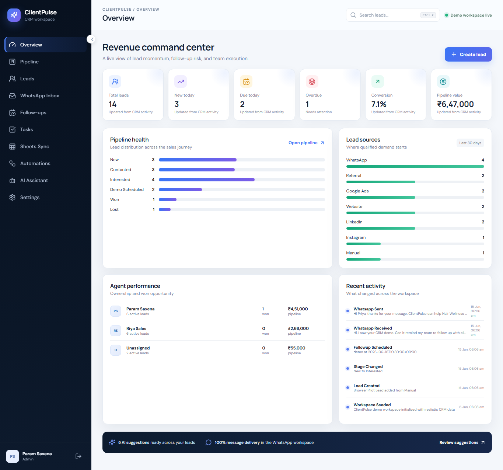
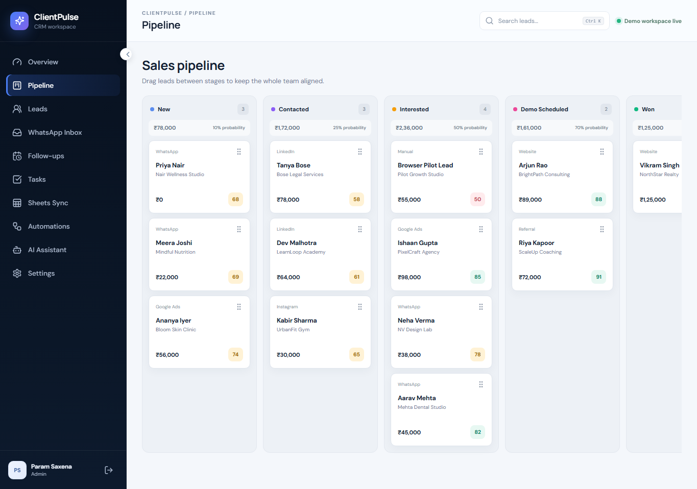
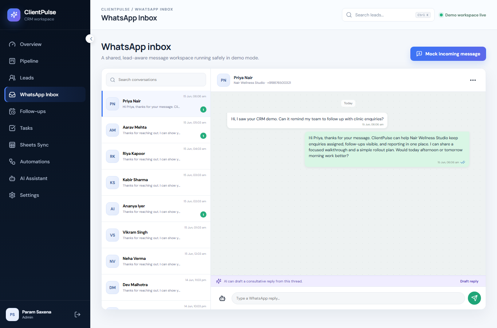
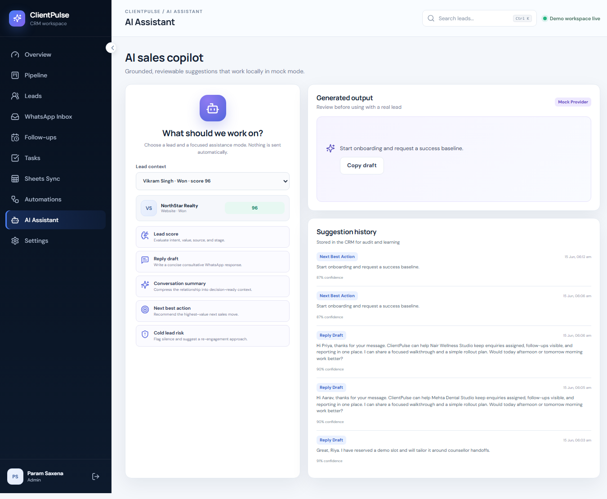
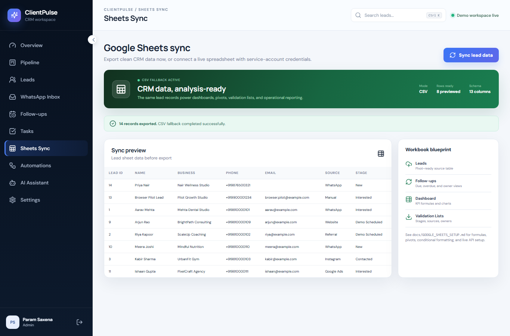
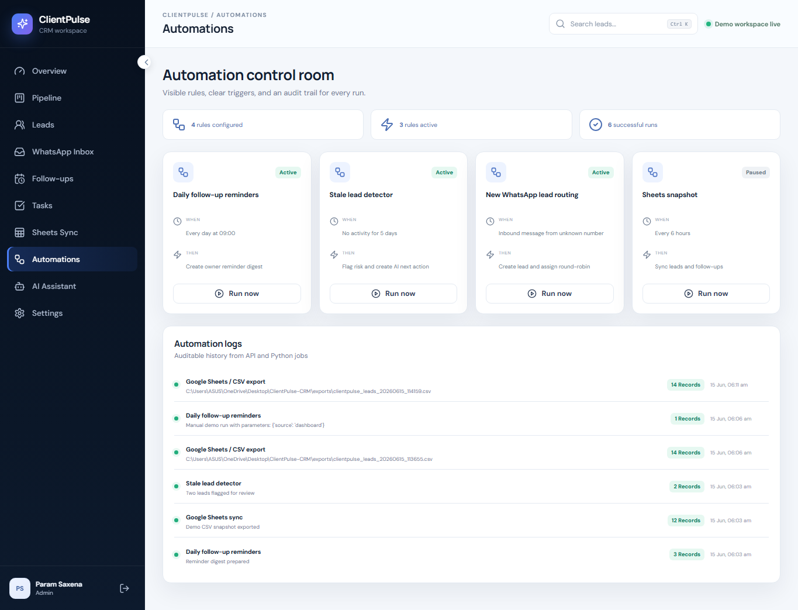
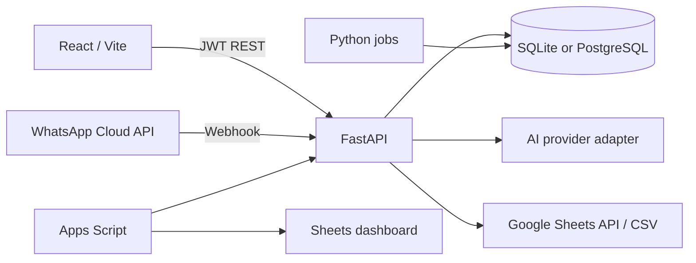

# ClientPulse CRM

**WhatsApp and Google Sheets lead management for small teams that cannot afford to lose a
follow-up.**

[](backend/)
[](frontend/)
[](backend/tests/)
[](LICENSE)

ClientPulse CRM gives clinics, coaching institutes, agencies, freelancers, and local service
businesses one workspace for WhatsApp enquiries, sales stages, owner follow-ups, AI-assisted
replies, and Google Sheets reporting.

It works immediately in persistent demo mode with no paid credentials. The same product
workflows switch to WhatsApp Cloud API, Google Sheets API, PostgreSQL, and a future AI
provider through environment variables.

Built by **Param Saxena** · [param5saxena@gmail.com](mailto:param5saxena@gmail.com) ·
[GitHub](https://github.com/neel-5)

## Product screenshots

| Overview | Pipeline |
|---|---|
|  |  |

| WhatsApp Inbox | AI Assistant |
|---|---|
|  |  |

| Google Sheets Sync | Automation Logs |
|---|---|
|  |  |

## What problem it solves

Small teams often receive leads in personal WhatsApp chats, remember follow-ups manually,
and rebuild weekly reporting in a spreadsheet. That creates delayed responses, unclear
ownership, and no reliable answer to “what should we do next?”

ClientPulse connects the conversation to the CRM record:

- Capture manual or WhatsApp leads.
- Assign an owner and move through `New → Contacted → Interested → Demo Scheduled → Won/Lost`.
- Store WhatsApp history, notes, tasks, and activity.
- Schedule and complete follow-ups with overdue visibility.
- Generate local AI lead scores, replies, summaries, next actions, and risk notes.
- Export pivot-ready data to CSV or sync a live Google Sheet.
- Extend the workbook with Apps Script menus, validation, dashboard refresh, and reminders.

## Live-product features

- JWT authentication and `admin`, `sales_agent`, `viewer` role checks.
- Persisted SQLAlchemy models for users, leads, contacts, conversations, messages,
  follow-ups, tasks, stages, notes, activity logs, automation logs, and AI suggestions.
- Responsive SaaS UI with dashboard, table, kanban, inbox, detail, calendar/list, tasks,
  Sheets, automation, AI, and integration settings pages.
- Meta-style WhatsApp webhook verification and incoming payload handling.
- Google Sheets API service-account adapter with automatic CSV fallback.
- Six production-readable Python CLI jobs with logging and error handling.
- Six Apps Script modules and a Sheets template using formulas, pivots, validation, and
  conditional formatting.
- Swagger/OpenAPI at `/docs`, backend tests, Docker, Windows scripts, and GitHub Actions.
- An honest pilot onboarding and evidence system. No fake customer claims.

## Architecture



Read the decisions and boundaries in [docs/ARCHITECTURE.md](docs/ARCHITECTURE.md).

## Technology

| Layer | Stack |
|---|---|
| API | FastAPI, SQLAlchemy 2, Pydantic Settings, PyJWT |
| Web app | React 18, Vite, React Router, Lucide |
| Data | SQLite by default; PostgreSQL via `DATABASE_URL` |
| Integrations | Meta WhatsApp Cloud API, Google Sheets API, Google Apps Script |
| Automation | Python 3 CLI jobs, structured logging, reusable service layer |
| Delivery | Docker Compose, Nginx, PowerShell setup, GitHub Actions |

## Local setup

### Windows one-command setup

```powershell
cd "$HOME\OneDrive\Desktop\ClientPulse-CRM"
Set-ExecutionPolicy -Scope Process Bypass
.\scripts\setup_windows.ps1
.\scripts\start_windows.ps1
```

Open:

- Frontend: `http://localhost:5173`
- Backend: `http://localhost:8000`
- OpenAPI: `http://localhost:8000/docs`

### Manual setup

```powershell
cd backend
py -m venv .venv
.\.venv\Scripts\python.exe -m pip install -r requirements.txt
.\.venv\Scripts\python.exe -m uvicorn app.main:app --reload --port 8000
```

In a second terminal:

```powershell
cd frontend
npm install
npm run dev
```

Demo account:

```text
Email:    param5saxena@gmail.com
Password: Demo@123
```

Additional seeded roles:

```text
sales_agent: riya@clientpulse.demo / Demo@123
viewer:      viewer@clientpulse.demo / Demo@123
```

Change these passwords before any real pilot.

## Demo mode

The defaults are intentionally useful:

```env
WHATSAPP_MODE=mock
GOOGLE_SHEETS_MODE=csv
AI_PROVIDER=mock
```

Receive messages from the Inbox’s **Mock incoming message** action, generate deterministic
AI suggestions locally, and export Sheets-compatible CSV without external accounts.

## Production configuration

Copy `.env.example` to `.env`, use PostgreSQL, generate a strong `SECRET_KEY`, restrict
CORS, and add only the integrations the pilot has approved.

- [Deployment guide](docs/DEPLOYMENT.md)
- [WhatsApp Cloud API setup](docs/WHATSAPP_CLOUD_API_SETUP.md)
- [Google Sheets API setup](docs/GOOGLE_SHEETS_SETUP.md)
- [Apps Script setup](docs/APPS_SCRIPT_SETUP.md)

## Google Sheets dashboard

Import `sheets_template/*.csv` for a ready-to-customize workbook. The template demonstrates:

- Conversion, pipeline, due, and overdue formulas.
- Agent-wise and source-wise conversion.
- Pivot-ready flat source tables.
- Stage/source validation dropdowns.
- Won, lost, high-score, overdue, and due-soon conditional formatting.
- Apps Script menu, dashboard chart, reminders, webhook receiver, and API refresh.

## Python automation

Run from the project root:

```powershell
backend\.venv\Scripts\python.exe automation\sync_to_sheets.py
backend\.venv\Scripts\python.exe automation\export_backup.py
backend\.venv\Scripts\python.exe automation\daily_followup_reminders.py --hours 24
backend\.venv\Scripts\python.exe automation\stale_lead_detector.py --days 5
backend\.venv\Scripts\python.exe automation\batch_ai_lead_scoring.py --limit 50
backend\.venv\Scripts\python.exe automation\generate_demo_data.py
```

## API examples

The full workflow is documented in [docs/API_EXAMPLES.md](docs/API_EXAMPLES.md).

```http
POST /api/auth/login
POST /api/leads
POST /api/leads/{id}/move
POST /api/followups
POST /api/whatsapp/mock-message
POST /api/whatsapp/send
POST /api/ai/reply
POST /api/sheets/sync
```

## Verification

```powershell
.\scripts\verify_windows.ps1
```

This runs backend tests, the frontend production build, and a real automation job.

## Real-user validation

A working repository is not the same as a product in use. Use:

- [Launch playbook](product/LAUNCH_PLAYBOOK.md)
- [Onboarding checklist](product/USER_ONBOARDING_CHECKLIST.md)
- [Real-user validation record](product/REAL_USER_VALIDATION.md)
- [Pilot tracker](product/PILOT_USER_TRACKER.csv)
- [Feedback form](product/FEEDBACK_FORM.md)

Record actual businesses, frequency, feedback, product changes, and consented proof. Demo
data and fictional scenarios must remain clearly labeled.

## Two-minute demo

Use [product/VIDEO_DEMO_SCRIPT.md](product/VIDEO_DEMO_SCRIPT.md) to show the problem, one
complete workflow, Sheets/automation depth, public GitHub proof, honest pilot proof, what
broke, decisions, and learning.

## Repository map

```text
backend/          FastAPI, data model, services, tests
frontend/         React/Vite product UI
automation/       Python operations jobs
apps_script/      Google Apps Script modules
sheets_template/  Importable workbook source data
product/          Launch, onboarding, validation, feedback
docs/             Architecture, APIs, integrations, deployment
demo_assets/      Safe sample stories and walkthrough material
screenshots/      Verified product captures
scripts/          Windows setup, start, and verification
```

## License

[MIT](LICENSE)
