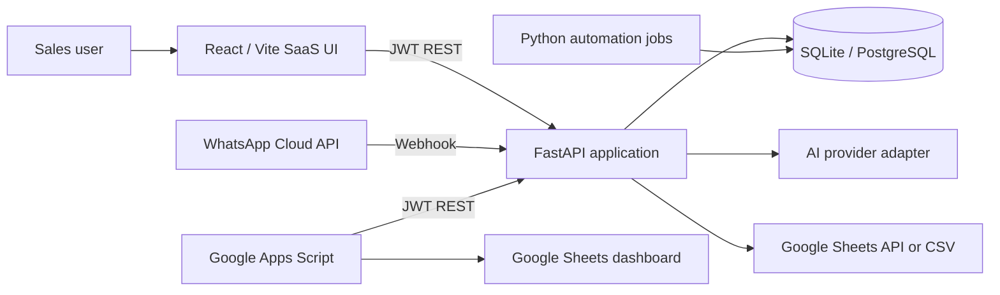

# ClientPulse CRM Architecture

## System shape

## Backend boundaries

- `routers/`: HTTP contracts, authorization, validation, and status codes.
- `services/`: provider adapters and business logic for AI, WhatsApp, and Sheets.
- `models.py`: SQLAlchemy domain model. `DATABASE_URL` selects SQLite or PostgreSQL.
- `seed.py`: idempotent realistic demo workspace.
- `automation/`: CLI jobs reuse the same database and service layer.

## Security model

- Passwords use PBKDF2-SHA256 with per-user random salts.
- JWT access tokens include user ID, role, and expiry.
- Mutating CRM routes allow `admin` and `sales_agent`; automation controls require `admin`.
- The `viewer` role can inspect dashboards and records but cannot change them.
- Provider secrets live in environment variables. `.env` is ignored by Git.

## Data model

`Lead` is the operational center. It connects to contacts, conversations, messages,
follow-ups, notes, tasks, activity logs, and AI suggestions. Pipeline stages are data,
not hardcoded database enums, so teams can later make them workspace-specific.

## Demo-to-production path

Demo mode persists all actions locally and returns deterministic AI suggestions. Production
mode changes adapters, not UI workflows:

- `WHATSAPP_MODE=real`
- `GOOGLE_SHEETS_MODE=google`
- `AI_PROVIDER=<provider>`
- `DATABASE_URL=postgresql+psycopg://...`

## Scaling decisions

The first release intentionally uses a synchronous SQLAlchemy session and a single FastAPI
service. A production growth path is: Alembic migrations, Redis/Celery background jobs,
workspace tenancy, webhook signature verification, token rotation, and row-level audit
retention.
